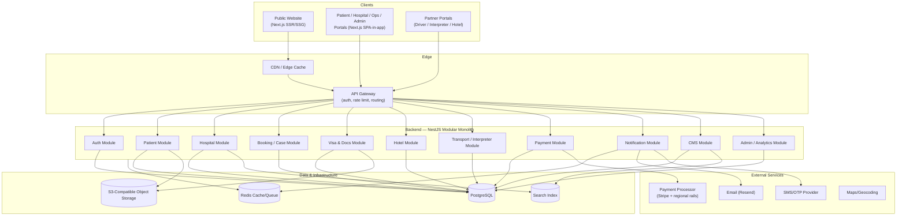
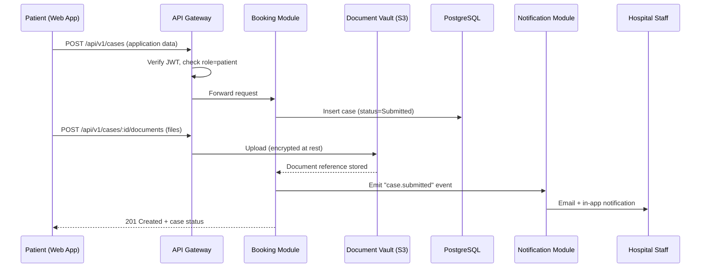

# System Architecture — Overview

This document defines the target technical architecture for the Asia Health Link and Travel platform, confirming and expanding the stack proposed in
`docs/PROJECT_CONTEXT.md` §5. It is the entry point for the detailed architecture docs
in this folder (frontend, backend, database, auth/security, storage/caching/search,
notifications, observability, deployment/CI-CD).

## 1. Architectural Style

**Modular monolith at launch, service-oriented from day one at the code-boundary level.**

Rather than launching with a full microservices deployment (high operational overhead for
a Phase-1 team) or a tangled monolith (hard to extract later), each business domain is
built as an independently owned **module** with its own database schema/tables, its own
API surface, and no direct cross-module database access — all cross-module reads go
through a defined internal API/service interface. This lets the platform:
- Ship faster initially (single deployable backend, simpler ops).
- Extract any module (e.g., Payments, Notifications) into its own deployed service later
  without a schema/API redesign, satisfying NFR-SCALE-02.

Modules map directly to the folder structure to be defined in Phase 4:
`auth`, `patient`, `hospital`, `booking` (applications/cases), `visa`, `hotel`,
`transport` (transfers), `interpreter`, `payment`, `notification`, `cms`, `admin`.

## 2. High-Level Component Diagram

## 3. Request Flow (Example: Submitting a Treatment Application)

## 4. Environments

| Environment | Purpose | Data |
|---|---|---|
| `local` | Individual developer machines, Docker Compose | Seeded/synthetic data only |
| `staging` | Pre-production QA, integration testing, demo | Anonymized/synthetic data, real integrations in sandbox mode (Stripe test mode, etc.) |
| `production` | Live platform | Real patient data — highest security tier |

No production data is ever copied to `local` or `staging` in identifiable form, per
NFR-COMP-01/02.

## 5. Cross-Cutting Concerns Index

| Concern | Document |
|---|---|
| Frontend architecture | `02-frontend-architecture.md` |
| Backend & API architecture | `03-backend-api-architecture.md` |
| Database architecture | `04-database-architecture.md` |
| Authentication & security | `05-auth-security-architecture.md` |
| Storage, caching, search | `06-storage-caching-search.md` |
| Notifications | `07-notification-architecture.md` |
| Observability (logging/monitoring) | `08-observability.md` |
| Deployment, CI/CD, infrastructure | `09-deployment-cicd-infrastructure.md` |

## 6. Key Architectural Decisions (ADR Summary)

| Decision | Rationale |
|---|---|
| Modular monolith over microservices at launch | Faster to ship and operate with a small team; module boundaries preserve a clean extraction path later |
| PostgreSQL as single relational store (not per-module databases) | Simpler transactional integrity across tightly-coupled domains (e.g., a case spans booking, visa, and payment); module-owned schemas keep logical separation |
| Server-rendered public site (Next.js SSR/SSG) | SEO is critical for hospital/specialty discovery traffic; authenticated portals can be client-heavy since SEO doesn't apply there |
| Redis for cache + lightweight job queue | Avoids introducing a separate message broker at launch scale; revisit (e.g., add a durable broker) if async workloads grow significantly |
| S3-compatible storage with server-side encryption for all documents | Meets NFR-SEC-02 without building custom encrypted storage |
| Event-driven notifications (internal event emission → Notification Module) | Decouples every module from knowing about email/SMS delivery details; centralizes template management and channel preference logic |
