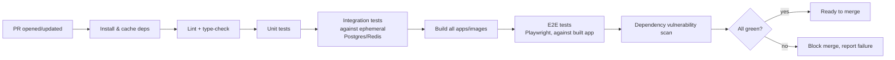
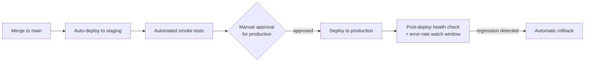

# Deployment, CI/CD & Infrastructure

## 1. Containerization

- Every deployable unit (`apps/web`, `apps/admin`, the NestJS backend) ships as a Docker
  image built from a multi-stage Dockerfile (build stage → slim runtime stage) to keep
  production images small and free of build tooling.
- `docker-compose.yml` at the repo root provides the full local development stack
  (Postgres, Redis, backend, both frontends, an S3-compatible local emulator such as
  MinIO) so `local` environment setup is a single command, per NFR-MAINT-03's
  reproducibility goal.

## 2. Infrastructure as Code

- All cloud infrastructure (compute, database, Redis, object storage, networking,
  DNS/CDN, secrets store) is defined as code (e.g., Terraform) rather than provisioned by
  hand through a cloud console, satisfying NFR-MAINT-03 and ensuring `staging` and
  `production` are structurally identical aside from scale/sizing parameters.
- Infrastructure changes go through the same PR review process as application code.

## 3. CI Pipeline (on every PR)

- Lighthouse CI runs against the public marketing routes on PRs touching those pages, to
  guard the NFR-PERF-01 budget.
- No merge to `main` is permitted with a failing pipeline (branch protection rule).

## 4. CD Pipeline

- Deploys to `staging` are automatic on every merge to `main`.
- Deploys to `production` require explicit manual approval (not fully automatic at
  launch, given the platform handles medical/financial data — a human confirms the
  release), but the deployment mechanics themselves are automated and repeatable.
- Deployments use a rolling/blue-green strategy so a bad release can be rolled back
  without downtime, monitored automatically against the error-rate/latency thresholds
  defined in `08-observability.md` §5 for a defined post-deploy window.

## 5. Database Migrations in the Pipeline

- Prisma migrations run as an explicit, separate pipeline step before the new
  application version receives traffic, and are written to be backward-compatible with
  the previous application version for the duration of a rolling deploy (per
  `04-database-architecture.md` §2), avoiding the class of outage where old code hits a
  migrated-away column.

## 6. Environments Recap

See `01-architecture-overview.md` §4 for the environment list; this document adds the
infrastructure-provisioning detail: `staging` and `production` run on separately
provisioned infrastructure (not just separate app instances against shared
infrastructure) so a `staging` incident (e.g., a runaway migration) cannot affect
`production` availability.

## 7. Domain, TLS, and CDN

- TLS certificates are provisioned and auto-renewed via the hosting platform/CDN
  provider (e.g., ACME/Let's Encrypt or the cloud provider's managed certificate
  service) — no manually-managed certificates.
- DNS and CDN configuration are part of the Infrastructure-as-Code definition (§2), not
  a manually-maintained registrar setting.

## 8. Secrets & Configuration per Environment

- Each environment (`local`, `staging`, `production`) has its own isolated secrets store
  entries — no secret is ever shared verbatim across environments (e.g., `staging` uses
  Stripe test-mode keys, never production keys), eliminating an entire class of
  cross-environment data-leak risk.

## 9. Disaster Recovery Summary

Building on `04-database-architecture.md` §6 (database backup/restore) and
`06-storage-caching-search.md` §1 (object storage), the platform's overall DR posture
targets: automated daily backups + point-in-time recovery for the database, versioned
and redundantly-stored object storage, infrastructure fully reproducible from code
(§2) so a full-environment rebuild is a pipeline run, not a manual, error-prone
rebuild-from-memory exercise.
