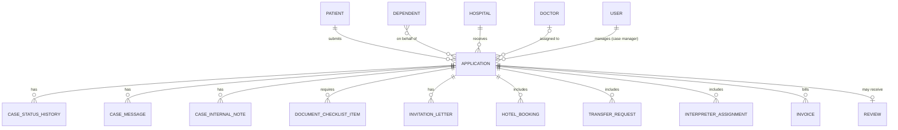
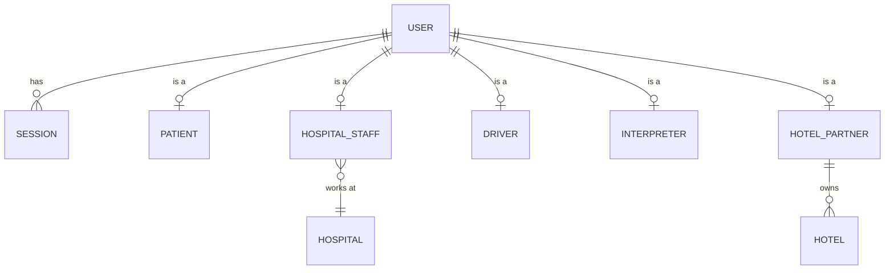
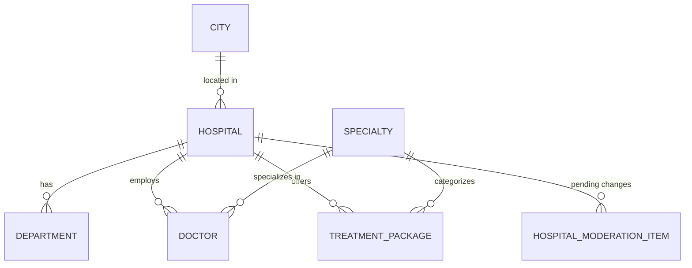
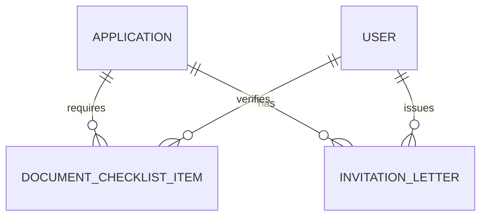
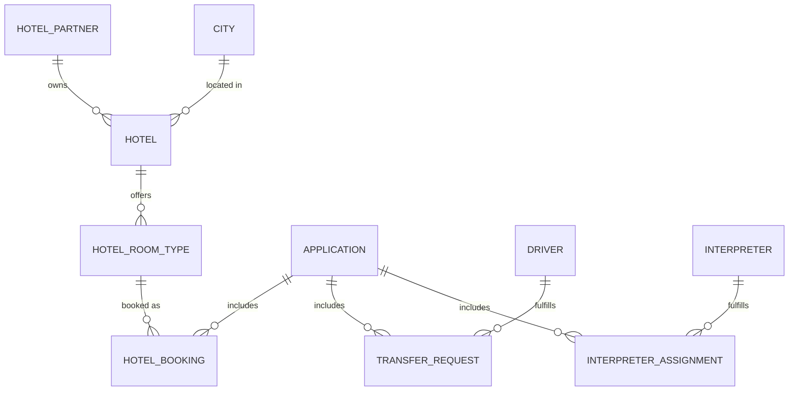
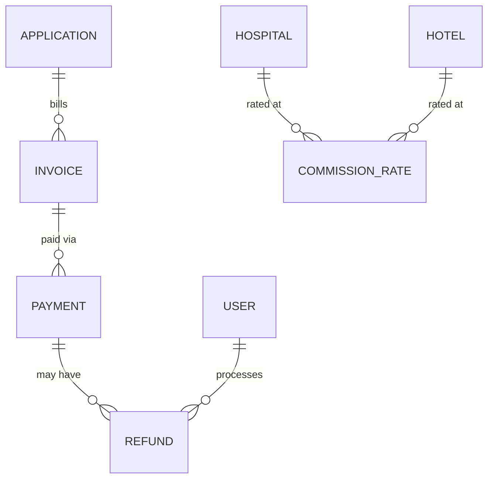
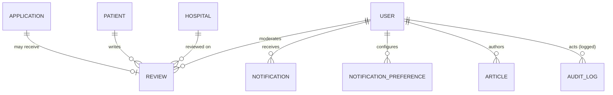

# Entity-Relationship Overview

Implements the Prisma schema at `database/prisma/schema.prisma` (validated against
Prisma 6 — see that file's header comment). This document groups the 40 models into the
same module ownership defined in `docs/03-architecture/04-database-architecture.md` §3,
since a single all-tables diagram would be unreadable. Field-by-field detail and
FR-*/BR-* traceability is in `02-schema-reference.md`.

## 1. Core case-centric hub

Every module ultimately hangs off `Application` (the "case") — this is the object every
portal (Patient, Hospital, Ops) views through a different lens, per
`docs/01-product-planning/10-sitemap-navigation-ia.md` §5 ("case-centric structure").

## 2. Auth & identity

Every operational role is a `User` row with a role-specific profile table — this keeps
authentication/authorization uniform (one `users` table, one login flow) while letting
each role carry its own fields without a wide, mostly-null `users` table.

## 3. Hospital & catalog

`City` and `Specialty` are small, admin-editable lookup tables (per NFR-SCALE-01 — new
cities/specialties are data, not code) that both the Hospital directory and the
Doctor/TreatmentPackage catalog key off of.

## 4. Visa & documents

`DocumentChecklistItem.fileStorageKey` and `InvitationLetter.fileStorageKey` are
references into the private object-storage `documents` bucket
(`docs/03-architecture/06-storage-caching-search.md` §1) — the database never stores
file bytes, only access-controlled pointers to them.

## 5. Hotel & transport

## 6. Payments & commissions

`CommissionRate` references either `hospitalId` or `hotelId` (never both) rather than a
single polymorphic foreign key, since Prisma/Postgres don't support true polymorphic
relations cleanly — the `partnerType` enum disambiguates which side is populated.

## 7. Reviews, notifications, CMS, admin

## Design notes carried over from the architecture doc

- **Soft deletes** (`deletedAt`) on `Application`, `DocumentChecklistItem`,
  `HotelBooking`, `TransferRequest`, `InterpreterAssignment`, `Invoice`,
  `CommissionRate`, and `Review` — anything that must remain recoverable/auditable per
  `docs/03-architecture/04-database-architecture.md` §5. Everything else uses normal
  deletion since it carries no compliance/dispute weight.
- **`AuditLog` is append-only** — no `deletedAt`, no `updatedAt`; the application layer
  must never issue `UPDATE`/`DELETE` against it, enforced by code review and, longer
  term, a database-level trigger or restricted role grant.
- **No cross-module direct writes.** Every foreign key crossing a module boundary
  (e.g., `Application.hospitalId → Hospital.id`) is a read reference; writes to a
  module's own tables happen only through that module's service layer, per
  `docs/03-architecture/03-backend-api-architecture.md` §2.
- **Row-level multi-tenancy**, not schema-per-tenant: `HospitalStaff.hospitalId`,
  `HotelPartner`→`Hotel.hotelPartnerId`, `Driver`/`Interpreter`→`userId` are the scoping
  columns a request-scoped context filters every query by (§8 of the backend
  architecture doc) — there is no per-tenant database or schema.
